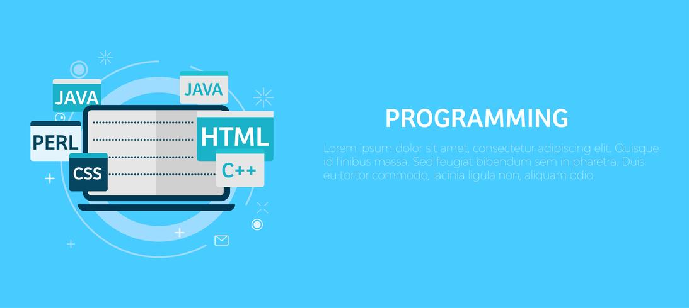

<h1 align="center">Hola!!,  Bienvenidos a mi perfil de GitHub, Mi nombre es Santiago Pererz 👋</h1>

## Sobre mí persona

- Desarrollador Web.
- Actualmente estoy aprendiendo nuevas tecnologías y mejorando mis habilidades en desarrollo de software.
- Tengo experiencia en desarrollo web FrontEnd con lenguajes como HTML, CSS y JAVASCRIPT.
- Mi currículum [Por aquí](https://drive.google.com/file/d/11p2pGKTjphtzO26lYhp0pmE33vN5tLq0/view?usp=sharing).
- Mi Instagram [Por aquí](https://www.instagram.com/santiperez_04?igsh=MXFrNThzdHFrMWU5aw==).

 

## Proyectos
<table>
<tr>
<td width="50%">
<h3 align="center">Proyecto de App de Gestión de Lotes</h3>

Aplicación móvil para la gestión de lotes.

</td>
<td width="50%">
<h3 align="center">Proyecto de Bolsa de Trabajo Informal</h3>

                                       

 

Aplicación web para lograr una bolsa de trabajo informal.

                                                             
</td>
</tr>
</table>
 

